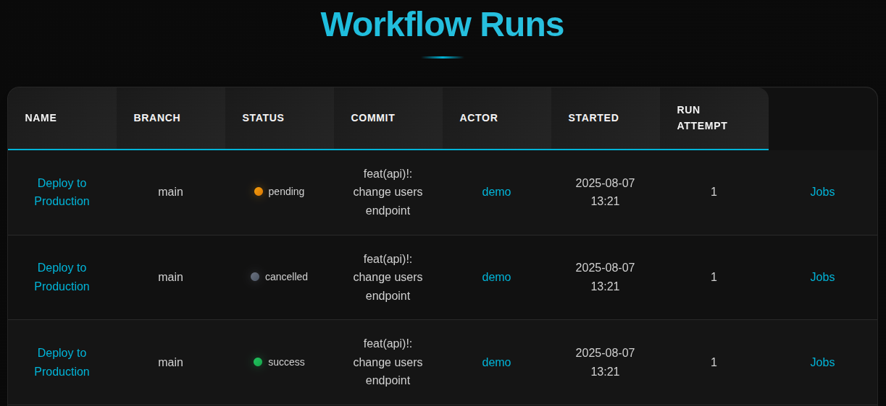

# 🚀 GitActions Dashboard: Workflow Run Jobs Viewer

A simple web application to display details of GitHub Actions workflow runs and their steps and logs, built with Go and HTML templates.

## 📸 Preview



---
# Table of contents

* [Features](#-features)
* [Teach Stack](#-tech-stack)
* [Usage](#️-usage)
    - [Run from source](#run-from-source)
    - [Run using Docker](#run-using-docker)

---

## 📦 Features

- 🧾 Displays detailed information about a GitHub Actions workflow run.
- ✅ Shows job and step-level status, conclusions, timestamps, and logs.
- 🎨 Simple, responsive UI with dark mode.
- 🔗 Dynamic routing using Go’s `net/http`.
- 📁 Static asset support (CSS, images, favicon).

---

## 🔧 Tech Stack

- **Backend:** Go (`net/http`, `html/template`)
- **Frontend:** HTML5, CSS3
- **Templating:** Go HTML Templates

---

## ⚙️ Usage

### Run from source

```bash
git clone git@github.com:isadri/gitactions-dashboard.git
cd gitactions-dashboard
```

Create `.env` file with:

```bash
cp .env.template .env
```

> [!NOTE]
> You will need to provide your GitHub access token in GITHUB_TOKEN environment variable. Refer to its [documentation](https://docs.github.com/en/authentication/keeping-your-account-and-data-secure/managing-your-personal-access-tokens#creating-a-personal-access-token-classic) to see how to generate the token.

and change the variables based on your needs. Then start the app with:

```bash
go build -o dash cmd/app/main.go
./dash
```

Access the dashboard by visiting http://APP_BIND:APP_PORT.

### Run using Docker

It is also possible to run the app using Docker. Using Docker is easy:

```bash
docker run --rm -p 8000:8000 -e GITHUB_TOKEN=<your access token> -e APP_BIND=0.0.0.0 -e ORG_NAME=<your organization or your account> -e FOR_USER=<set this to 1 if you want to use your own account> isadri/gitactions-dashboard
```
Access the dashboard by visiting http://APP_BIND:APP_PORT.
